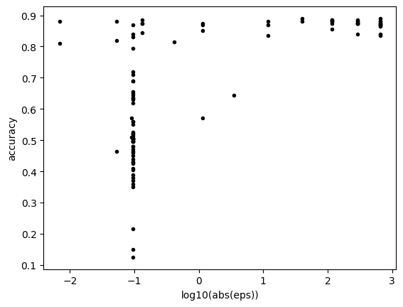

# Summary
PRESTO (Privacy REcommendation and SecuriTy Optimization) is a Python-based toolkit that automates the selection of differential-privacy mechanisms to balance data utility and privacy loss. By integrating descriptive and inferential statistics, Bayesian optimization, and data-similarity metrics, PRESTO analyzes arbitrary datasets—numerical, categorical, or structured—and recommends the optimal privacy algorithm and $\varepsilon$-parameter setting. Its modular design supports CPU/GPU execution, streaming and batch data, and extensibility for new algorithms and utility metrics. PRESTO's automated multi-objective optimization delivers application-specific, data-driven recommendations with quantified uncertainty, empowering both experts and non-experts to integrate privacy-preserving methods seamlessly into their workflows.

# Statement of Need
As data collection proliferates across healthcare, finance, IoT, and beyond, safeguarding individual privacy without handicapping downstream analytics has become critical. Existing differential-privacy tools often require deep theoretical knowledge, manual tuning of privacy parameters, and trial-and-error to discover the right trade-off between noise injection and data utility. This steep adoption barrier impedes widespread deployment of privacy-preserving analytics in industrial and research settings. There is a pressing need for an intuitive, automated solution that can—given any dataset—identify the most suitable privacy mechanism and its optimal $\varepsilon$, quantify the remaining utility, and provide confidence intervals on its recommendations. PRESTO fills this gap, reducing the technical burden and accelerating safe, compliant data analysis.

# State of the Field
A variety of packages from industry and academia—such as IBM’s Diffprivlib, Google’s PyDP (and TensorFlow Privacy), Facebook’s Opacus, LDP-Pure, SmartNoise, PETINA—offer implementations of noise-based DP mechanisms (Laplace, Gaussian, Exponential), local-DP protocols (Randomized Response, RAPPOR), and gradient perturbation for machine learning. However, they typically expose raw APIs, leaving users responsible for selecting and tuning algorithms, and provide limited guidance on choosing $\varepsilon$. Recent research has explored automatic hyperparameter tuning via cross-validation or surrogate modeling, but these approaches rarely integrate multi-objective optimization or deliver quantitative uncertainty measures.

PRESTO advances the state of the art by unifying statistical dataset analysis, Bayesian optimization, and data-similarity metrics into a single recommendation engine. It implements a broad suite of privacy mechanisms—including both batch and streaming algorithms—and automates their selection based on data characteristics and user-specified privacy–utility trade-offs, while providing 95% confidence intervals on its recommendations. Crucially, PRESTO is built on a modular architecture, enabling users to plug in new privacy algorithms or custom utility metrics at any time without modifying core logic. This extensibility ensures that PRESTO can evolve alongside emerging research and domain-specific needs, making it uniquely adaptable compared to existing static libraries.

# Methodology
1. **Dataset Profiling**

    - Compute descriptive (mean, variance, skewness, kurtosis) and, for categorical data, domain-size and frequency distributions.

2. **Mechanism Library**

    - Maintain a dictionary of privacy functions (`get_noise_generators()`), each mapping `(data, \varepsilon) → privatized_data`.
  
   
3. **Bayesian Optimization of $\varepsilon$**

    - For each mechanism, define:

        $$
        f(\varepsilon) = -\mathrm{RMSE}\bigl(\text{data},\,\text{mechanism}_\varepsilon(\text{data})\bigr)
        $$

    - Maximize this over:

        $$
        \varepsilon \in [\varepsilon_{\min},\,\varepsilon_{\max}]
        $$

      using Gaussian‐process Bayesian optimization.

4. **Confidence & Reliability**

    - Compute a 95% confidence interval on RMSE at the optimal $\varepsilon$*, then define:

        $$
        \mathrm{Reliability}
        = \frac{1}{\text{Mean RMSE}\times \text{CI Width}}.
        $$

5. **Similarity Assessment**  

   - Measure distributional similarity via Kolmogorov–Smirnov, Jensen–Shannon, Pearson correlation.  
   
6. **Multi‐Objective Ranking**  

   - Recommend top mechanisms on **max similarity**, **max reliability**, and **max privacy** axes.
   

# Experiments
We conducted experiments to evaluate the effectiveness of our approach.

### Energy Compumtion with Bayesian Optimization (Dataset: Hourly Consumption (Min))
1. Privacy loss (epsilon) vs utility (RMSE) for selected/preferred privacy algorithms 
2. Top-3 Recommendations:
   DP_Laplace: $\varepsilon$=3.6277, mean_rmse=0.3817, ci_width=0.0279, reliability=93.90 
   DP_Exponential: $\varepsilon$=3.6300, mean_rmse=0.3835, ci_width=0.0416, reliability=62.68 
   DP_Gaussian: $\varepsilon$=4.1687, mean_rmse=0.8326, ci_width=0.0525, reliability=22.88 

### Medical Measuments with Bayesian Optimization (Dataset: Heart Rate (Min))
1. Privacy loss (epsilon) vs utility (RMSE) for selected/preferred privacy algorithms 
2. Top-3 Recommendations:
   DP_Laplace: $\varepsilon$=3.6254, mean_rmse=0.3901, ci_width=0.0054, reliability=474.71 
   DP_Exponential: $\varepsilon$=3.6319, mean_rmse=0.3916, ci_width=0.0051, reliability=500.71 
   DP_Gaussian: $\varepsilon$=5.0000, mean_rmse=0.6824, ci_width=0.0047, reliability=311.79 

### Finance Transactions with Bayesian Optimization (Dataset: Payment Transactions (Min))
1. Privacy loss (epsilon) vs utility (RMSE) for selected/preferred privacy algorithms 
2. Top-3 Recommendations:
   DP_Laplace: $\varepsilon$=4.1687, mean_rmse=0.3461, ci_width=0.0340, reliability=84.98 
   DP_Exponential: $\varepsilon$=3.6296, mean_rmse=0.3864, ci_width=0.0453, reliability=57.13 
   DP_Gaussian: $\varepsilon$=4.1690, mean_rmse=0.8270, ci_width=0.0560, reliability=21.59 

### Sensor Temperature Time‐Series with Bayesian Optimization (Dataset: Payment Transactions (Min))
1. Privacy loss (epsilon) vs utility (RMSE) for selected/preferred privacy algorithms 
2. Top-3 Recommendations:
   DP_Laplace: $\varepsilon$=3.6296, mean_rmse=0.3846, ci_width=0.0126, reliability=206.36 
   DP_Exponential: $\varepsilon$=3.6296, mean_rmse=0.3883, ci_width=0.0187, reliability=137.72 
   DP_Gaussian: $\varepsilon$=3.6296, mean_rmse=0.9459, ci_width=0.0334, reliability=31.65 

### Energy Consumption with Fixed epsilon = 1

1. The best algorithm for a given $\varepsilon$

Best by Similarity:  {'algorithm': 'PercentilePrivacy', 'score': np.float32(0.9841)} 
Best by Reliability: {'algorithm': 'PercentilePrivacy', 'score': inf} 
Best by Privacy:     {'algorithm': 'Hadamard_Mechanism', 'score': 71.6581} 

### ML Classification with Private Gradients
Baseline Accuracy (no privacy): 93.00% 
DP Accuracy with 'PercentilePrivacy': 94.00%

### ML Classification with Private Gradients

1. Pareto front for privacy budget vs accuracy

{ width=0.3\textwidth float=left }

# Conclusion
PRESTO delivers a data-driven, automated, and extensible framework for differential-privacy mechanism selection and tuning. By profiling statistical properties, optimizing $\varepsilon$ via Bayesian methods, and quantifying both utility and uncertainty, PRESTO guides users to the privacy solution best suited for their data. Its modular design allows seamless integration of new algorithms and metrics, positioning PRESTO as a flexible platform for both practitioners and researchers aiming to embed privacy guarantees in diverse analytical workflows.

# Acknowledgements
This manuscript has been co-authored by UT-Battelle, LLC under Contract No. DE-AC05-00OR22725 with the U.S. Department of Energy. The United States Government retains and the publisher, by accepting the article for publication, acknowledges that the United States Government retains a non-exclusive, paid-up, irrevocable, world-wide license to publish or reproduce the published form of this manuscript, or allow others to do so, for United States Government purposes. The Department of Energy will provide public access to these results of federally sponsored research in accordance with the DOE Public Access Plan (http://energy.gov/downloads/doe-public-access-plan).
This material is based upon work supported by the U.S. Department of Energy, Office of Science, Office of Advanced Scientific Computing Research under Contract No. DE-AC05-00OR22725. This research is sponsored by the Artificial Intelligence Initiative as part of the LDRD-SEED Program, at ORNL, managed by UT-Battelle, LLC and DOE ASCR Program. 

# References
